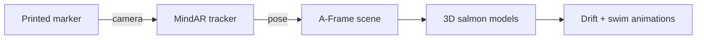

<p align="center">
  
</p>

<h1 align="center">Salmon AR</h1>

<p align="center">
  <strong>Point your phone at a printed salmon sign and watch fish swim upstream in augmented reality.</strong><br/>
  No app install. No native build. Just a browser and a marker.
</p>

<p align="center">
  <a href="https://github.com/TheMitchyBoy/Salmon-Run/blob/main/LICENSE"></a>
  <a href="https://nodejs.org/"></a>
  <a href="https://aframe.io/"></a>
  <a href="https://hiukim.github.io/mind-ar-js-doc/"></a>
  <a href="https://railway.app/"></a>
</p>

<p align="center">
  <a href="#quick-start">Quick start</a> ·
  <a href="#how-it-works">How it works</a> ·
  <a href="#deploy">Deploy</a> ·
  <a href="#troubleshooting">Troubleshooting</a> ·
  <a href="#customization">Customization</a>
</p>

---

## Overview

**Salmon AR** is a lightweight WebAR experience built for **Ketchikan Creek**. It overlays animated 3D salmon on a printed image marker using your phone's camera — powered by [A-Frame](https://aframe.io/) and [MindAR](https://hiukim.github.io/mind-ar-js-doc/) image tracking.

| | |
|---|---|
| **Platform** | Mobile Safari (iOS) · Chrome (Android) |
| **Stack** | HTML · A-Frame · MindAR · glTF |
| **Hosting** | Railway (HTTPS) · Netlify · Vercel · localhost |
| **Dependencies** | Zero npm packages — libraries are vendored |

### Features

- **Instant WebAR** — open a URL, allow the camera, point at the sign
- **Self-contained** — A-Frame, MindAR, and aframe-extras ship in `vendor/` (no CDN required)
- **Procedural swim animation** — tail-wag and drift even without a baked GLB clip
- **Clear diagnostics** — helpful error screens instead of an endless loading spinner
- **One-command deploy** — `npm start` serves everything over HTTPS on Railway

---

## Quick start

### Try it locally

```bash
git clone https://github.com/TheMitchyBoy/Salmon-Run.git
cd Salmon-Run
npm start
```

Open **http://localhost:8080** on your phone (same Wi‑Fi) or desktop. `localhost` counts as a secure context, so the camera works.

> **Note:** Do not open the HTML files directly (`file://`). Browsers block camera access outside `https://` or `http://localhost`.

### Verify your setup first

Deploy or serve **`loading-test.html`** before the main experience. It uses MindAR's hosted example card and model — if that works, your environment is fine and any issues are with local assets (`targets.mind`, `salmon.glb`).

---

## How it works



1. **Marker** — A printed sign is compiled into a `.mind` target file (via the built-in admin dashboard or the [MindAR compiler](https://hiukim.github.io/mind-ar-js-doc/tools/compile)).
2. **Tracking** — MindAR watches the camera feed and locks virtual content to the marker.
3. **Rendering** — A-Frame places three `salmon.glb` models on the marker, each with procedural drift (upstream motion) and swim (tail-wag + bob).
4. **Serving** — The Node server (`server.js`) delivers the AR app, API, and stored target sets over HTTPS in production.

---

## Admin dashboard — compile & publish markers

No need to use the external MindAR compiler site. This repo includes a built-in admin UI that uses the **same MindAR compiler engine** bundled in `vendor/`.

| | |
|---|---|
| **URL** | `/admin.html` on your deployed site |
| **Auth** | `ADMIN_PASSWORD` environment variable |
| **Storage** | Compiled `.mind` files in `data/` (auto-seeded from bundled `targets.mind` on first run) |

### Workflow

1. Set `ADMIN_PASSWORD` in Railway (or copy `.env.example` locally).
2. Open **`https://your-app.up.railway.app/admin.html`** and sign in.
3. **Drop one or more marker images** (PNG/JPG) — each image becomes a trackable target.
4. Click **Compile** — feature points are visualized (same as the official MindAR tool).
5. Click **Publish to live app** — the compiled target is saved and set as the active marker for the AR experience.

The main app at `/` loads the active target from `GET /api/targets/active` automatically.

### Persistence on Railway

By default, `data/` lives on the container filesystem and **resets on redeploy**. For production:

- Mount a [Railway Volume](https://docs.railway.app/guides/volumes) at `/data` and set `DATA_DIR=/data`, or
- Keep using the bundled `targets.mind` as your baseline and re-publish after deploys.

### API (for integrations)

| Endpoint | Auth | Description |
|----------|------|-------------|
| `GET /api/health` | — | Server status |
| `POST /api/auth/login` | — | Returns bearer token |
| `GET /api/targets/active` | — | Active `.mind` binary (used by AR app) |
| `GET /api/targets` | Admin | List all target sets |
| `POST /api/targets` | Admin | Upload compiled target (`mindBase64`, `name`, `imageNames`) |
| `PUT /api/targets/:id/activate` | Admin | Switch live marker |
| `DELETE /api/targets/:id` | Admin | Remove a target set |

---

## Project structure

```
Salmon-Run/
├── index.html           # Main WebAR experience (loads /api/targets/active)
├── admin.html           # Admin dashboard — compile & publish markers
├── loading-test.html    # Pipeline smoke test (MindAR example assets)
├── salmon.glb           # 3D salmon model
├── targets.mind         # Default/bundled image-target data
├── server.js            # Static server + target API
├── lib/
│   ├── store.js         # File-based target database
│   └── auth.js          # Admin session auth
├── data/                # Runtime storage (gitignored; created on first run)
├── package.json
├── railway.json         # Railway deploy config
├── vendor/              # Bundled A-Frame, MindAR, aframe-extras
└── docs/
    └── banner.svg       # README header graphic
```

---

## Deploy

### Railway (recommended)

This repo is configured for [Railway](https://railway.app) out of the box. Railway terminates TLS, which WebAR requires for camera access.

1. **New Project** → **Deploy from GitHub repo** → select **Salmon-Run**
2. Railway detects Node, runs `npm start` (`PORT` is injected automatically)
3. **Variables** → add `ADMIN_PASSWORD` (enables `/admin.html`)
4. **Settings → Networking** → **Generate Domain** for a public `https://…up.railway.app` URL
5. Open the URL on your phone and tap **Allow** for the camera

Every push to the connected branch redeploys automatically.

### Alternatives

| Platform | Notes |
|----------|-------|
| **Netlify / Vercel** | Connect the repo — static hosting with free HTTPS |
| **GitHub Pages** | Works if served over HTTPS; ensure `vendor/` and binary assets deploy |
| **Local** | `npm start` or `PORT=3000 npm start` |

---

## Troubleshooting

<details>
<summary><strong>App stuck on loading spinner</strong></summary>

Common causes, in order:

1. **Insecure context** — opened via `file://` or plain `http://` (not localhost). Serve over `https://` or `http://localhost`.
2. **Camera permission denied** — reload and tap **Allow**. Clear site permissions if you blocked it earlier.
3. **Missing `vendor/`** — libraries load locally; keep `vendor/` next to the HTML when deploying.
4. **Camera in use** — close other apps or tabs using the camera, then reload.

Try `loading-test.html` to isolate environment vs. asset issues.

</details>

<details>
<summary><strong>Camera works but no salmon appear</strong></summary>

1. **Marker not detected** — the status pill should change to *"The salmon are running"*. Improve lighting, hold steady, and confirm the print matches the image used to compile `targets.mind`.
2. **Fish too small/large** — adjust `scale` on each `<a-gltf-model>` in `index.html` (marker width = 1 unit).
3. **Wrong facing** — change `rotation="0 0 0"` to `rotation="0 180 0"` if models face away.
4. **No tail motion** — `salmon.glb` has no baked clip; swim is procedural. Swap in a rigged model with clips and add `animation-mixer` if preferred.

</details>

---

## Customization

| Goal | Where to look |
|------|----------------|
| Change fish count, size, speed | `index.html` — `<a-gltf-model>` entities inside `[mindar-image-target]` |
| Swap the 3D model | Replace `salmon.glb`, update `<a-asset-item>` |
| New marker image | Use `/admin.html` or recompile with MindAR → publish via API |
| Status copy / UI colors | `#status` styles and JS event handlers in `index.html` |

---

## Development

```bash
npm start            # http://localhost:8080
PORT=3000 npm start  # custom port
```

**Requirements:** Node.js 18+

There are no build steps or npm dependencies. The server exists solely to serve static files with correct MIME types for `.glb` and `.mind` assets.

---

## Contributing

Issues and pull requests are welcome. See [CONTRIBUTING.md](CONTRIBUTING.md) for guidelines.

---

## License

[MIT](LICENSE) © [TheMitchyBoy](https://github.com/TheMitchyBoy)

---

<p align="center">
  <sub>Built for Ketchikan Creek · WebAR without the app store</sub>
</p>
